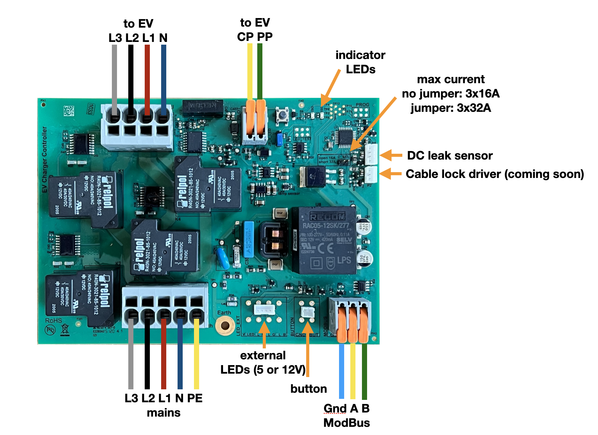
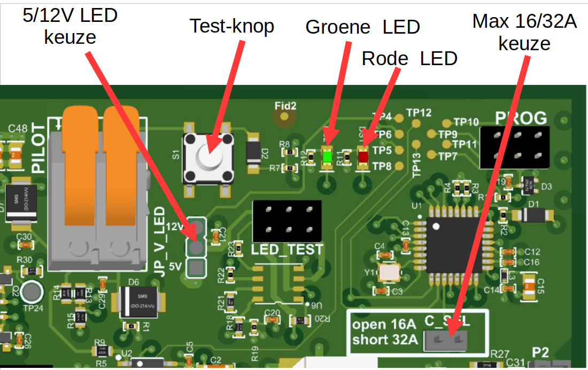

# DHZ laadpaal
Kijk, wij hebben alle voorbereidingen voor je gedaan!
We zullen je nu stap voor stap helpen om alles in elkaar te zetten.

Volg de stappen in onderstaande overzicht:
1. [De basis-configuratie](installation/module-kl.png) – de “domme laadpaal”, dus zonder stroomsturing (load-balancing)
2. Met stroomsturing (load-balancing). Kies dan uit één van onderstaande opties:
    - Gebruik een ESP-device of een Pi-pico gekoppeld aan de een DSMR 4 of 5  slimme meter en verbind deze via een RS485-kabel (Modbus) aan het laadstation
    - Gebruik een Raspberry Pi mini-computer met USB-kabel aan een DSMR 4 of 5 slimme meter en een RS485-interface. Gebruik het pakket EVCC om het laadstation aan te sturen
    - Gebruik de Edgetech WiFi-module:
      1. Heeft u een DSMR5 slimme meter? Dan kunt de EVSE-SC-02 module rechtstreeks aan de slimme meter koppelen
      2. Heeft u geen slimme meter of een ouder type? Dan moet de stroom met stroomklemmen (CT) gemeten worden en heeft u type EVSE-SC-01 nodig.

> [!IMPORTANT]
> Dit document is geschreven voor ervaren hobbyïsten. Dus mensen die op een veilige manier apparaten op een 3-fase voedingskabel kunnen aansluiten.
> Die weten wat aardlekautomaten zijn en de basis-principes kennen voor het aansluiten van grote stroomgebruikers via de meterkast.
> Wij raden altijd aan om wijzigingen in de meterkast door een erkende elektricien uit te laten voeren.

# 1. De Basis-configuratie
Met de basis-configuratie maak je een laadpunt zonder stroomsturing. Dat betekent dat het laadpunt geen rekening houdt met andere stroomgebruikers in het huis. Dit kan mogelijk voor problemen zorgen bij te grote stroomvraag. Zorg dat je dus alleen laadt op die momenten dat er voldoende capaciteit beschikbaar is. Dat is typisch het geval vanaf ‘s avonds 22 uur tot 4 uur in de ochtend. Houdt dus rekening met moglijk aanwezigheid van warmtepompen, thuis-accu’s en elektrische boilers. De basis-configuratie bestaat uit deze onderdelen:
- laad-module
- DC-aardlek-module met aansluitkabel
- laadkabel
- behuizing en wartels
- montage-beugels

Je kunt deze behuizing zelf eenvoudig in elkaar zetten. Je hebt zelf nog de keuze om de montage-beugels te gebruiken als de standaard-montage van de laad-module niet geschikt is voor jouw situatie.

## LED aansluiten
Op de laad-module kun je een 5VDc of 12VDC LED aansluiten.
[Kijk hier](installation/adding%20LED%20to%20charger.pdf) voor het aansluitschema.

## Stappen voor de assemblage
- Hieronder vind je het overzicht van alle aansluitingen

- Bepaal waar het laadpunt wordt geplaatst. We raden aan om altijd ook een Modbus-kabel naast de voedingskabel aan te leggen. Let er op dat u de **juiste Modbus-kabel gebruik**t. Deze kabel is bijvoorbeeld heel geschikt: https://www.elektroproducten.nl/product/stuurstroom-flex-liyy-3x05mm%C2%B2-per-meter/
- Kies de handige plaats voor montage van de wartels voor de ingaande voedingskabel en uitgaande laadkabel. Boor gaten voor de wartels met een stappenboor. Boor ook gaten in de achterwand voor stevige montage op een muur of paal. Let er op dat je de schroefgaten waterdicht maakt met b.v. een rubberring of druppel kit.
- Kies de oriëntatie van de laad-module – schroef deze vast of lijm de montagebeugels goed aan de achterwand van de kast.
- Monteer de laad-module in de kast.
- Verbind de DC-aardlek-module aan de laad-module met de meegeleverde draad
- Verbind de meegeleverde draad aardedraad (groen-geel) met het grijze blok met 5 ingangen. Plaats deze op ingang PE. Verbind de andere zijde met de meegeleverde WAGO-connector.
- Voer de laadkabel door de wartel heen. Vervolgens:
  - steek de aders in de juiste uitgangen op het grijze blok met 4 uitgangen. Let op de juiste kleuren voor het verbinden. Sluit de aarde-ader (PE in het plaatje / groen-geel) aan op de meegeleverde losse WAGO-connector. Je kunt de uitgang ontgrendelen door een platte schroevendraaier in het rechthoekige gat te steken – op dat moment kan de ader in de uitgang worden gestoken.
  - Steek de dunne ader in het grijze blokje met twee oranje heveltje, kies daar de uitgang “PP”, in het plaatje hierboven aangeduid met gele draad met “CP”. Zorg dat je het heveltje helemaal omhoog klikt en de ader diep genoeg in de uitgang steekt. Klik dan het heveltje weer omlaag en controleer dat de ader goed vast zit.
- Schroef de behuizing nu vast op de muur of paal en steek de voedingskabel door de wartel. Vervolgens:
  - Steek de aders van de voedingskabel in de juiste ingangen, let goed op de kleuren op de grijze connector met 5 ingangen.
  - Verbind de aarde-ader (PE) met de WAGO-connector
  - Controleer dat de aders in de grijze connector onderling GEEN contact maken. Dat kan het geval zijn indien er aders met gevlochten draad gebruikt worden. Dan kunnen losse koper draadjes net buiten de ingang blijven zitten en kortsluiting veroorzaken. Let dus goed op!
- Ziet alles er goed uit? Dan kun je de aardlekautomaat in groepenkast activeren. Controleer dat het groene LEDje op de laad-module elke 3 seconden knippert. Zie hier voor de plaats van het groene LEDje:

> [!IMPORTANT]
> indien het rode LEDje knippert controleer dan of de aarde goed is aangesloten, zowel op de laad-module als ook verbonden met de aarde van het huis.

## Test met het opladen van een auto
Als u bovenstaande stappen heeft gevolgd en het LEDje op de laad-module groen knippert dan kunt u gaan controleren of uw auto opgeladen kan worden. Sluit de laadkabel op de auto aan. Gaat de auto laden? Gefeliciteerd! Is dat niet het geval kijk dan op de laad-module en controleer of de rode LED af & toe knippert. Afhankelijk van de volgorde van knipperen kunt u bepalen wat de fout is:

| Conditie                                      | Weergave rode LED                                             |
|-----------------------------------------------|---------------------------------------------------------------|
| Fout bij opstarten (00000001)                 | Heel lang uit, erg kort aan                                   |
| Temperatuur hoog (10010000)                   | Kort aan, kort uit, kort aan, lang uit                        |
| Temperatuur te hoog, laden gestopt (10011000) | Kort aan, kort uit, 2x kort aan, lang uit                     |
| Geen aarde aangesloten (10011100)             | Kort aan, kort uit, 3x kort aan, even uit                     |
| Relais blijft ingeschakeld (10011110)         | Kort aan, kort uit, 4x kort aan, kort uit                     |
| DC-aardlek (10010110)                         | Kort aan, kort uit, kort aan, kort uit, 2x kort aan, kort uit |
| Ok                                            | Continue uit                                                  |

# 2. Load-balancing
Load-balancing is een goed idee om je elektriciteitsaansuiting te beschermen tegen overbelasting. Als je namelijk te lang meer energie gebruikt dan de hoofdzekering aan kan zal deze doorbranden of afslaan. Bij oude zekeringen zul je je netbeheerder moeten bellen om de hoofdzekering te laten vervangen. Dat kost geld en veel tijd. Daarnaast is het ook verstandig om te laden op die momenten dat energie goedkoop is, danwel om het elektriciteitsnetwerk te ontlasten. Kortom, je wilt de tijd en het laden kunnen sturen en dat wordt ook wel load-balancing genoemd. Je kunt kiezen uit één van onderstaande mogelijkheden om load-balancing mogelijk te maken. Natuurlijk kun je de aansturing zelf maken op een platform van jouw keuze.

## A. Ervaren hobbyïst (bv Raspberry Pi Pico of ESPhome)
Deze optie is geschikt voor mensen met programmeerervaring op bijvoorbeld een Arduino of ESP-platform. Daarnaast moet je een programmeerbare module kiezen die kan worden uitgebreid met een RS485 (Modbus) interface. Wij hebben een Waveshare ESP32-S3 WiFi-module met RS485 getest (https://www.waveshare.com/esp32-s3-relay-1ch.htm). Volg de wiki van Waveshare (https://www.waveshare.com/wiki/ESP32-S3-Relay-1CH) voor de juiste aansluitingen en wijze van het laden van code. Een eenvoudig voorbeeld om de laad-module uit te lezen staat [hier](Controllers).
Alle informatie over de laad-module zoals aansluitingen en Modbus-registers staan op [Github](/)

## B. Linux-gebruiker: Raspberry Pi met EVCC
Deze optie is geschikt voor mensen die wel eens op een Linux-systeem hebben gewerkt en enige ervaring hebben in het gebruik met de command line via een terminal.
Het voordeel van deze keuze is dat je bijvoorbeeld een Raspberry Pi 3B kunt kiezen waarop ook een slimme meter kan worden aangesloten met een speciale USB-kabel. Voorbeeld configuratie:
- Raspberry Pi 3B: b.v. bij https://www.kiwi-electronics.com/nl/home/
- Slimme meter P1-kabel zie: https://www.sossolutions.nl/slimme-meter-kabel
- Zonder solderen bijvoorbeeld een “Waveshare RS485 CAN HAT”. Waveshare documenteert netjes met een Wiki-pagina hoe je deze voor de Pi moet instellen: https://www.waveshare.com/wiki/RS485_CAN_HAT#RS485_Usage Deze module is te koop bij Tinytronics, https://www.tinytronics.nl/nl/communicatie-en-signalen/serieel/rs-485/waveshare-rs485-can-hat-voor-raspberry-pi

In onderstaande overzicht gaan we uit van een Raspberry Pi model 3B.

Volg de onderstaande stappen
- Gebruik de Raspbian Imager ( https://www.raspberrypi.com/software/ ) om het SD-kaartje voor de Rapsberry te schrijven. Let erop dat je een hostnaam kiest die je terug kunt vinden, bv loadbalancer. Heb je een Pi zonder Ethernet vul dan ook de WiFi-gegevens in zodat je altijd op afstand bij de Pi met ssh.
- Volg de stappen om de Pi met je netwerk verbonden te krijgen.
- Open een terminal of login met ssh op de Pi
- Volg dan de stappen op https://docs.evcc.io/en/docs/installation
- Kies in de configuratie voor de Edgetech Smart EVSE
- Kies de juiste adapter voor de Modbus-adaper, Modbus-adres 2, baudrate 9600, 8N1. Dit is een voorbeeld-stuk uit de evcc.yaml file voor de Waveshare adapter:

```configuration
chargers:
- type: template
  template: smartevse
  id: 2
  device: /dev/ttyS0
  baudrate: 9600
  comset: 8N1
  modbus: rs485serial
  name: laadpunt1
```

- Heb je ook de slimme meter P1-kabel? Dan moet je op de Pi ook het software-pakket ser2net installeren. Volg de handleiding van ser2net om de seriële poort via een netwerk-socket bereikbaar te maken.
Hieronder een voorbeeld van de definitie van de grid-meter in de evcc.yaml file en daaronder een voorbeeld configurtie van ser2net.conf:
```configuration
####################
#blok voor EVCC
meters:
- type: template
  template: dsmr
  usage: grid
  host: 127.0.0.1  # host: ser2net
  port: 2000
  name: grid
###################
```
```
###################
#blok voor ser2net.yaml
%YAML 1.1
---
# This is a ser2net configuration file, tailored to be rather simple.

define: &banner \r\nser2net port \p device \d [\B] (Debian GNU/Linux)\r\n\r\n

connection: &conDSMR
    accepter: tcp,2000
    enable: on
    options:
      max-connections: 3
      kickolduser: true
      telnet-brk-on-sync: true
    connector: serialdev,
              /dev/ttyUSB0,
              115200n81,local
###################
```

- volg de stappen onder https://docs.evcc.io/en/docs/features/loadmanagement om load-balancing toe te voegen

# C. Edgetech WiFi-module
## 1. EVSE-SC-01 met CT-klemmen
*Deze optie is voor mensen die geen slimme meter hebben van het type DSMR5.*

Wilt u zelf toch niet met de aansturing via Modbus aan de gang maar wel zelf alles aanleggen, dan is deze optie geschikt voor u.
[Hier](installation/module-site-kl.png) ziet u de configuratie. Voor deze configuratie moet je dus een extra module in de groepenkast plaatsen.
Verder moet u de CT-klemmen om voedingsaders van de hoofdaansluiting plaatsen.


## 2. EVSE-SC-02 met RJ12-kabel
*Deze optie is voor mensen met een slimme meter van het type DSMR5.*

Met de EVSE-SC-02 kunt u heel snel en eenvoudig load-balancing toevoegen. Voor de rest geldt ook hier dat de juiste Modbus-kabel gebruikt
moet worden en de handleiding gevolgd moet worden. Omdat er geen stroomklemmen geplaatst hoeven worden en deze module buiten de meterkast
wordt geplaatst is deze optie eenvoudiger voor de installatie. Ook scheelt het ruimte in de groepenkast.
[Hier](installation/module_site-sm-kl.png) ziet u de configuratie.

Voor deze twee opties (EVSE-SC-01 en EVSE-SC-02) zijn de volgende aandachtspunten belangrijk:
- Let er op dat u de juiste Modbus-kabel gebruikt. Deze kabel is bijvoorbeeld heel geschikt: https://www.elektroproducten.nl/product/stuurstroom-flex-liyy-3x05mm%C2%B2-per-meter/
- U kunt de handleiding voor de installatie vinden op:  https://github.com/edge-tech-eu/SmartEVSE/tree/main
- Deze modules maken gebruik van een cloud-server. U kunt deze gratis de eerste 60 dagen gratis gebruiken. Zie voor alle details wat u met het abonnement kunt https://mycharger.edgetech.nl/. Verder kun je ook een API gebruiken om zelf het proces van starten en stoppen van laden aan te sturen, zie informatie hierover op https://mycharger.edgetech.eu/ waarin aansturing vanuit HomeAssistant wordt uitgelegd.  Zonder abonnement werkt load-balancing gewoon verder, maar kunt u niet meer aansturen. We zijn momenteel bezig om ook een lokale API toe te voegen. Meer details volgen op deze pagina's.
