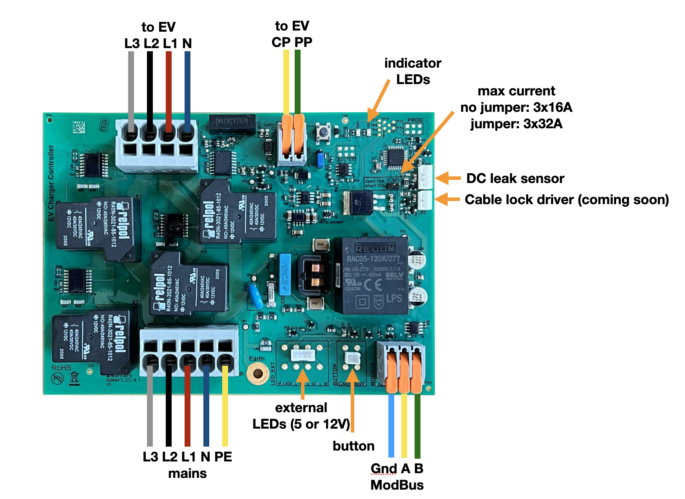

# DIY charging station
Look, we've done all the prep work for you!
We'll now help you put everything together step by step.

Follow the steps in the overview below:
1. [The basic configuration](installation/module-kl.png) – the “dumb charging station”, i.e. without load balancing
2. With power control (load balancing). Then choose one of the options below:
   - Use an ESP device or a Pi pico connected to a DSMR 4 or 5 smart meter and connect it to the charging station via an RS485 cable (Modbus)
   - Use a Raspberry Pi mini-computer with a USB cable connected to a DSMR 4 or 5 smart meter and an RS485 interface. Use the EVCC package to control the charging station
   - Use the Edgetech WiFi module:
     1. Do you have a DSMR5 smart meter? Then you can connect the EVSE-SC-02 module directly to the smart meter
     2. Do you not have a smart meter or do you have an older type? Then the current must be measured with current clamps (CT) and you will need type EVSE-SC-01.

> [!IMPORTANT]
> This document is written for experienced hobbyists. In other words, people who know how to safely connect devices to a 3-phase power cable.
> People who know what earth leakage circuit breakers are and understand the basic principles of connecting large power consumers via the meter box.
> We always recommend that changes to the meter box be carried out by a certified electrician.
# 1. The Basic configuration

With the basic configuration, you create a charging point without power control. This means that the charging point does not take other power users in the house into account. This can potentially cause problems if the power demand is too high. Therefore, ensure that you only charge when there is sufficient capacity available. This is typically the case from 10 p.m. to 4 a.m. Take into account the possible presence of heat pumps, home batteries and electric boilers. The basic configuration consists of the following components:

- charging module
- DC earth leakage module with connection cable
- charging cable
- housing and cable glands
- mounting brackets

You can easily assemble this housing yourself. You also have the option of using the mounting brackets if the standard mounting of the charging module is not suitable for your situation.


## Connecting the LED

You can connect a 5VDC or 12VDC LED to the charging module.

[Click here](installation/adding%20LED%20to%20charger.pdf) for the connection diagram.


## Assembly steps

- Below is an overview of all connections



- Decide where to place the charging point. We recommend always installing a Modbus cable alongside the power cable. Make sure you use the **correct Modbus cable**. This cable, for example, is very suitable: https://www.elektroproducten.nl/product/stuurstroom-flex-liyy-3x05mm%C2%B2-per-meter/

- Choose a convenient location for mounting the glands for the incoming power cable and outgoing charging cable. Drill holes for the glands using a step drill. Also drill holes in the rear wall for secure mounting on a wall or pole. Make sure you seal the screw holes with, for example, a rubber ring or drip sealant.

- Choose the orientation of the charging module – screw it in place or glue the mounting brackets securely to the rear wall of the cabinet.

- Mount the charging module in the cabinet.

- Connect the DC earth leakage module to the charging module using the supplied wire.

- Connect the supplied earth wire (green-yellow) to the grey block with 5 inputs. Place this on input PE. Connect the other side to the supplied WAGO connector.

- Feed the charging cable through the cable gland. Then:

- Insert the wires into the correct outputs on the grey block with 4 outputs. Make sure you use the correct colours for the connection. Connect the earth wire (PE in the diagram / green-yellow) to the supplied separate WAGO connector. You can unlock the output by inserting a flat screwdriver into the rectangular hole – at that point, the wire can be inserted into the output.

  Insert the thin wire into the grey block with two orange levers, select the “PP” output, indicated in the diagram above by the yellow wire with “CP”. Make sure you click the lever all the way up and insert the wire deep enough into the output. Then click the lever back down and check that the wire is securely fastened.


- Now screw the housing onto the wall or pole and insert the power cable through the cable gland. Next:

- Insert the wires of the power cable into the correct inputs, paying close attention to the colours on the grey connector with 5 inputs.

  - Connect the earth wire (PE) to the WAGO connector.

  - Check that the wires in the grey connector do NOT touch each other. This can happen if wires with braided strands are used. Loose copper strands can remain just outside the input and cause a short circuit. So be careful!

- Does everything look good? Then you can activate the earth leakage circuit breaker in the fuse box. Check that the green LED on the charging module flashes every 3 seconds. See here for the location of the green LED:


> [!IMPORTANT]
> If the red LED flashes, check that the earth is properly connected, both to the charging module and to the earth of the house.


## Test by charging a car

If you have followed the above steps and the LED on the charging module is flashing green,
you can check whether your car can be charged. Connect the charging cable to the car.
Is the car charging? Congratulations! If not, check the charging module and see if the red LED
is flashing occasionally. Depending on the flashing pattern, you can determine what the fault is:

| Condition                                         | Red LED display                                                  |
| ------------------------------------------------- | ---------------------------------------------------------------- |
| Start-up error (00000001)                         | Very long off, very short on                                     |
| High temperature (10010000)                       | Short on, short off, short on, long off                          |
| Temperature too high, charging stopped (10011000) | Short on, short off, 2x short on, long off                       |
| No earth connected (10011100)                     | Short on, short off, 3x short on, briefly off                    |
| Relay remains switched on (10011110)              | Short on, short off, 4x short on, short off                      |
| DC earth fault (10010110)                         | Short on, short off, short on, short off, 2x short on, short off |
| OK                                                | Continuous off                                                   |

# 2. Load balancing

Load balancing is a good idea to protect your electricity connection from overload. If you use more energy than the main fuse can handle for too long, it will blow or trip. With old fuses, you will have to call your network operator to have the main fuse replaced. That costs money and takes a lot of time. In addition, it is also wise to charge at times when energy is cheap, or to relieve the electricity network. In short, you want to be able to control the time and charging, which is also known as load balancing. You can choose from one of the options below to enable load balancing. Of course, you can create the control yourself on a platform of your choice.


## A. Experienced hobbyist (e.g. Raspberry Pi Pico or ESPhome)

This option is suitable for people with programming experience on, for example, an Arduino or ESP platform. In addition, you must choose a programmable module that can be expanded with an RS485 (Modbus) interface. We have tested a Waveshare ESP32-S3 WiFi module with RS485 (https://www.waveshare.com/esp32-s3-relay-1ch.htm). Follow the Waveshare wiki (https://www.waveshare.com/wiki/ESP32-S3-Relay-1CH) for the correct connections and how to load code. A simple example of how to read the charging module can be found [here](Controllers).

All information about the charging module, such as connections and Modbus registers, can be found on [Github](/).

## B. Linux user: Raspberry Pi with EVCC

This option is suitable for people who have worked on a Linux system before and have some experience using the command line via a terminal.

The advantage of this choice is that you can, for example, choose a Raspberry Pi 3B to which a smart meter can also be connected with a special USB cable. Example configuration:

- Raspberry Pi 3B: e.g. at https://www.kiwi-electronics.com/nl/home/

- Smart meter P1 cable, see: https://www.sossolutions.nl/slimme-meter-kabel

- Without soldering, for example, a ‘Waveshare RS485 CAN HAT’. Waveshare provides clear documentation on a Wiki page on how to set this up for the Pi: https://www.waveshare.com/wiki/RS485_CAN_HAT#RS485_Usage This module is available from Tinytronics, https://www.tinytronics.nl/nl/communicatie-en-signalen/serieel/rs-485/waveshare-rs485-can-hat-voor-raspberry-pi


In the overview below, we assume you are using a Raspberry Pi model 3B.

Follow these steps:
- Use the Raspbian Imager ( https://www.raspberrypi.com/software/ ) to write the SD card for the Raspberry. Make sure you choose a host name that you can find again, e.g. load balancer. If you have a Pi without Ethernet, also enter the WiFi details so that you can always access the Pi remotely with ssh.
  - Follow the steps to connect the Pi to your network.
  - Open a terminal or log in with ssh on the Pi
  - Follow the steps at https://docs.evcc.io/en/docs/installation
  - Select the Edgetech Smart EVSE in the configuration
  - Select the correct adapter for the Modbus adapter, Modbus address 2, baud rate 9600, 8N1. This is an example from the evcc.yaml file for the Waveshare adapter:


```configuration
chargers:
- type: template
  template: smartevse
  id: 2
  device: /dev/ttyS0
  baud rate: 9600
  comset: 8N1
  modbus: rs485serial
  name: charging point 1

```

- Do you also have the smart meter P1 cable? Then you also need to install the ser2net software package on the Pi. Follow the ser2net manual to make the serial port accessible via a network socket.

Below is an example of the definition of the grid meter in the evcc.yaml file and below that an example configuration of ser2net.conf:
```configuration
####################
#blok voor EVCC
meters:
- type: template
  template: dsmr
  usage: grid
  host: 127.0.0.1  # host: ser2net
  port: 2000
  name: grid
###################
```

```
###################
#blok voor ser2net.yaml
%YAML 1.1
---
# This is a ser2net configuration file, tailored to be rather simple.
define: &banner \r\nser2net port \p device \d [\B] (Debian GNU/Linux)\r\n\r\n

connection: &conDSMR
    accepter: tcp,2000
    enable: on
    options:
      max-connections: 3
      kickolduser: true
      telnet-brk-on-sync: true
    connector: serialdev,
              /dev/ttyUSB0,
              115200n81,local
###################
```

- Then follow the steps at https://docs.evcc.io/en/docs/installation

